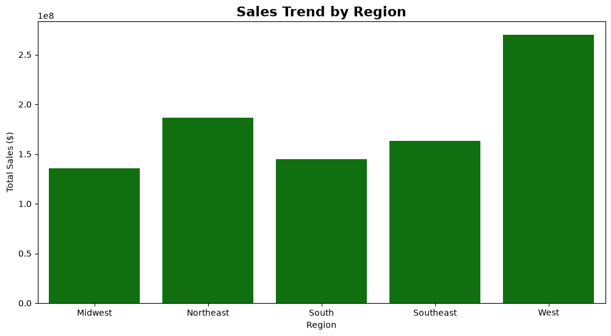
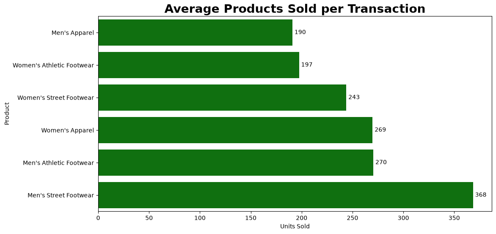
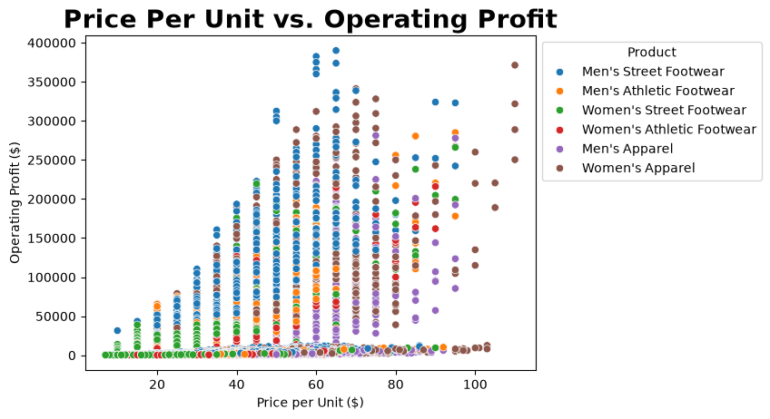
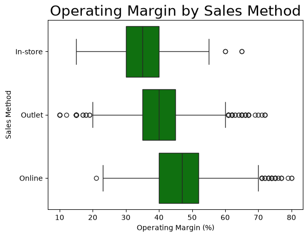

# Adidas Sales Data Analysis

## Project Overview
This project explores the **Adidas Sales Dataset** to uncover trends, patterns, and insights related to Adidas product sales across different regions in the United States. The analysis uses Python for data cleaning and visualisation, with a focus on understanding what drives revenue and profitability across regions, products, and sales channels.

---

## Dataset
The dataset contains transactional sales data for Adidas products across multiple U.S. regions. Each row represents a single sales transaction with the following columns:

| Column | Description |
|---|---|
| `Retailer` | Name of the retailer |
| `Retailer ID` | Unique ID assigned to each retailer |
| `Invoice Date` | Date of the sales invoice |
| `Region` | Region where the sale took place |
| `State` | State within the region |
| `City` | City where the sale occurred |
| `Product` | Name of the Adidas product sold |
| `Price per Unit` | Price per unit of the product |
| `Units Sold` | Quantity of units sold |
| `Total Sales` | Total sales amount for the transaction |
| `Operating Profit` | Profit generated from the sale |
| `Operating Margin` | Profit margin for the transaction |
| `Sales Method` | Method used for the sales transaction (In-store / Outlet / Online) |

---

## Setup & Installation

### Prerequisites
- Python 3.x
- VS Code with the Jupyter extension

### Steps

1. Clone this repository:
   ```bash
   git clone https://github.com/YOUR_USERNAME/adidas-sales.git
   cd adidas-sales
   ```

2. Create and activate a virtual environment:
   ```bash
   python3 -m venv venv
   source venv/bin/activate   # Mac/Linux
   venv\Scripts\activate      # Windows
   ```

3. Install dependencies:
   ```bash
   pip install -r requirements.txt
   ```

4. Open the notebook:
   - Launch VS Code in the project folder: `code .`
   - Open `analysis.ipynb`
   - Select the `venv` Python interpreter when prompted

---

## Project Structure

```
adidas-sales/
├── images/                        # Chart exports used in this README
├── Adidas Sales Dataset.csv       # Raw dataset
├── analysis.ipynb                 # Main Jupyter notebook with all analysis
├── requirements.txt               # Project dependencies
└── README.md                      # This file
```

---

## Data Preparation

Before visualising the data, several cleaning steps were applied:

- Removed an unnamed index column left over from the CSV export
- Stripped currency symbols (`$`) and percentage signs (`%`) from numeric columns and converted them to `float`
- Converted the `Invoice Date` column to a proper `datetime` data type
- Converted `Units Sold` to `integer`
- Renamed columns for readability (e.g. `Total Sales` → `Total Sales ($)`)
- Confirmed no missing values were present across the dataset

---

## Analysis & Key Findings

### 1. Sales Trend by Region



- The **West region leads in total sales**, reaching approximately **$270 million** — the highest of all five regions by a significant margin
- The **Northeast** is a strong second at roughly **$185 million**, indicating healthy demand in both major coastal markets
- The **South** recorded the **lowest total sales**, falling below $150 million
- The **Southeast and Midwest** sit in the middle tier, both performing similarly around $160–165 million

---

### 2. Units Sold by Product



- **Men's Street Footwear** is the best-selling product by volume, approaching **375 units per transaction** — well ahead of every other category
- **Women's Apparel** and **Men's Athletic Footwear** are tied for second at approximately **265–270 units**
- **Women's Street Footwear** follows closely at around **245 units**
- **Men's Apparel** and **Women's Athletic Footwear** are the lowest-selling categories, both sitting around **195–200 units**

---

### 3. Price per Unit vs. Operating Profit



- There is a **clear positive relationship** between price per unit and operating profit — higher-priced products consistently generate more profit per transaction
- The **$45–$65 price range** is the sweet spot: products in this band (predominantly Men's Street Footwear) drive both the **highest sales volume and the highest operating profit**, with some transactions exceeding **$380,000** in profit
- Products priced **below $30** generate comparatively low operating profit across all categories
- Above **$80**, transaction frequency drops, suggesting reduced consumer demand at premium price points

---

### 4. Operating Margin by Sales Method



- **Online** is the most profitable channel, with operating margins clustered between **40–55%** and a notable group of transactions reaching **70–80%**
- **In-store** is the most consistent channel, with margins reliably sitting around **35–50%** and very few extremes — a dependable but moderate performer
- **Outlet** shows the **widest variability**: some transactions achieve very high margins, while others fall close to 10%, likely reflecting discounting or clearance activity

---

## Recommendations

| Area | Recommendation |
|---|---|
| **Regional focus** | Prioritise investment in the West and Northeast, which together drive the most revenue |
| **Product strategy** | Men's Street Footwear leads in both volume and profit — pricing in the $45–$65 band appears optimal and should be protected |
| **Channel growth** | Online sales deliver the highest margins; growing the online channel through digital marketing and better fulfilment would improve overall profitability |
| **Outlet consistency** | Investigate which products, regions, or periods drive low-margin outlet transactions to reduce variability |
| **Next steps** | The dataset includes invoice dates not yet used — a monthly or quarterly trend chart would reveal seasonality and support demand forecasting |

---

## Tools & Libraries

- **pandas** — data loading, cleaning, and transformation
- **matplotlib** — base plotting library
- **seaborn** — statistical visualisations (line, bar, scatter, box plots)
- **Jupyter Notebook** — interactive analysis environment

---